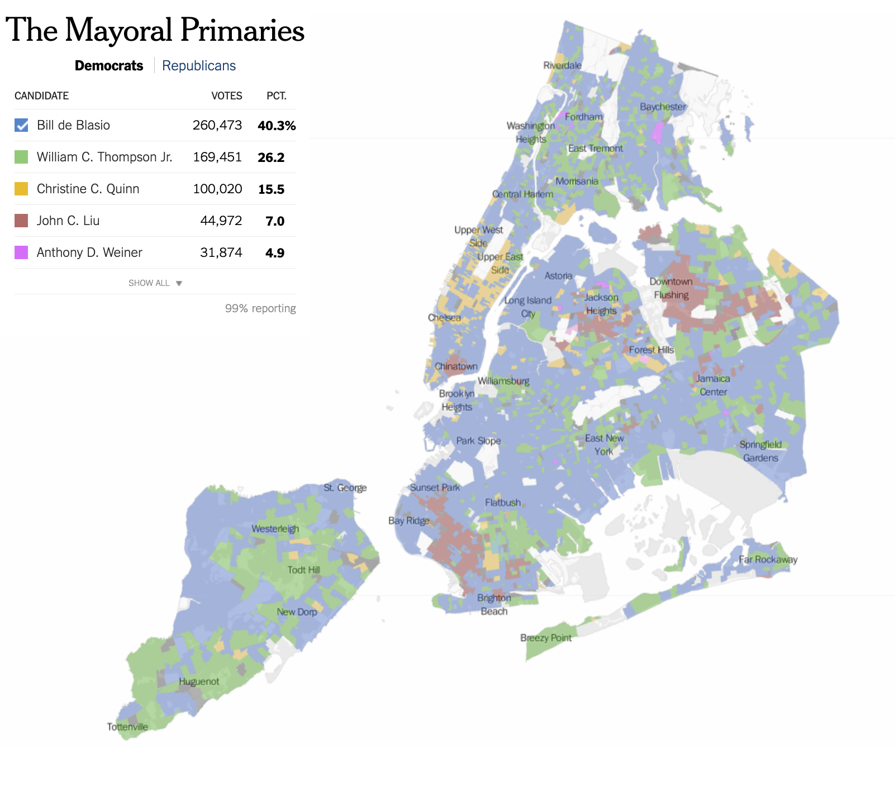

```{r setup, include=FALSE}
knitr::opts_chunk$set(echo = TRUE,
                      eval = TRUE,
                      error = FALSE,
                      message = FALSE,
                      warning = FALSE,
                      comment = NA)
```


```{r, include=FALSE}
#Package loading
pacman::p_load(leaflet, tidyverse, xaringan, knitr, sf, htmlwidgets)
```
class: inverse, center, middle
name: welcome

# Welcome!
<html><div style='float:left'></div><hr color='#EB811B' size=1px style="width:1000px; margin:auto;"/></html>

---
# Introduction

Have you ever tried to mark locations to use outside of Google Maps for any professional or personal project? Whether you are a planner, data scientist or urban policy enthusiast, R can help you do that in a simple, user-friendly way!

Today, we will introduce `leaflet`, a mapping package compatible with multiple platforms and apps... 

```{r, echo=FALSE, include=TRUE, out.width="60%", out.height="75%", fig.align= 'center'}
example1 <- leaflet() %>%
  addTiles() %>%  # Map tile in OpenStreetMap 
  addMarkers(lng=-99.16771, lat=19.427, popup="Let's begin!")
example1 #Mexico City
```


<br>
---
# What is Leaflet?

`leaflet` is a leading open-source JavaScript library. Its package is used to create and modify interactive maps, allowing us to:

- Easily visualize and explore geographic data, using a simple interface that integrates with R's data structures.
- Widely used, by media orgs. like The New York Times and The Washington Post and GIS specialists like OpenStreetMap.

```{r, echo=FALSE, include=TRUE, out.width="35%", out.height="35%", fig.align= 'center'}

```
Source: [The New York Times, 2013. Not for commercial use](https://www.nytimes.com/projects/elections/2013/nyc-primary/mayor/map.html).

<br>
---
# Why use Leaflet?
## What makes this package unique?

The `leaflet` package has a number of features that can be used to modify maps, such as:
- *View:* Zooming and Panning in and out.
- *Adding Layers*: Such as markers and polygon layers.
- *Styling:* Add different colours, sizes, icons and pop ups.
- *Built in Map tiles:* Access OpenStreetMap and other base map tiles.
- *Options for Plug-ins:* Supports the add-on of various plug-ins.

## What makes this package different from other packages?

While other packages, such as `ggplot` can also be used to generate and visualize maps in R, these tools only display static maps. `leaflet` allows you to create dynamic, responsive maps that can be easily customized.
---
# How to Use Leaflet in R?
## First: The Basics (Using Tiles and Markers)

1. *Install package.* Install the `leaflet` and `tidyverse` packages and load the library in R.

2. *Set base map.* You need a base map layer, or a background, before we begin adding layers. Tiles refer to the visual map that displays basic geographic features (e.g. streets, buildings, terrain). In this case, we will use `addTiles()`, which adds OpenStreetMap as default tiles. This is the foundation to display other layers. 

3. *Add coordinates.* You need to input a latitude and longitude in order to display the feature that we want. In this case, we will use `addMarkers()`, which will generate a marker in our target location. Additional, we can also include a pop up message that can be displayed with our marker.

<br>
---
# How to Use Leaflet in R? (cont.)
## First: The Basics (Using Tiles and Markers)
```{r, out.width="40%", out.height="40%"}
#Sample Code 
example2 <- leaflet() %>%
  addTiles() %>%  # Map tile in OpenStreetMap 
  addMarkers(
  	lng=-95.0900, lat=29.5593, #Latitude and Longitude
  	popup = "Hello from NASA Space Center!"
  	)
```

```{r, echo=FALSE, include=TRUE, out.width="50%", out.height="50%", fig.align= 'center'}
example2 <- leaflet() %>%
  addTiles() %>%
  addPopups(lng=-95.0900, lat=29.5593,
           "Hello from NASA Space Center!",
           options = popupOptions(autoOpen = TRUE, closeButton = FALSE))

example2
```

---
# More Features
## Second: Adding Multiple Layers (Markers)

You can add multiple markers by utilizing a real data frame. 

Have you ever wondered about the economics behind Airbnb prices in Berlin? In this example, we will use an open data from [Kristof and Lukasz (2021)](https://zenodo.org/records/4446043 ) on rental listings in European cities. The data can be found in the repository.

This example uses the `berlin_weekends.csv` file, which shows data on the weekend offers of AirBnb listings in Berlin containing:

- `lng`: longitude of the listing location.
- `lat`: latitude of the listing location.
- `room_type`: the type of the accommodation.

<br>

---
# More Features (cont.)
## Second: Adding Multiple Layers (Markers)

1. *Install packages.* Before we begin, make sure you install and load the `sf` and `htmlwidgets` packages. 

2. *Set base map and other layers the Airbnb data.* You will use base R to load the tiles the same way as before, this time using the Airbnb data. We will also use `setView()`to focus on Berlin and zoom out a bit. 

3. *Add all coordinates and room types* You need to include the coordinates and room types in the `berlin_weekends.csv`. This code below will include many pop ups for our listings.

---
# More Features (cont.)
## Second: Adding Multiple Layers (Markers)

```{r, echo=TRUE, include=TRUE, out.width="60%", out.height="40%", fig.align= 'center'}
airbnb_data <- read.csv("leaflet_workshopslides_files/data/berlin_weekends.csv")

#Base Map with Multiple Markers
leaflet(airbnb_data) %>% 
  addTiles() %>% 
  setView(lng = 13.404954, lat = 52.520008, zoom = 10) %>%
 addMarkers(lng = ~lng, lat = ~lat, popup = ~room_type)
```

If you hover over each marker, you can see the type of room from the CSV file.

<br>

---
# More Features (cont.)
## Third: Clustering (Markers)

Although the  map works, it does not give us any clear insight with so many markers. **Clustering** is a more useful way to show the listings by collapsing them with those that are closest, introducing color codes. 

```{r, echo=TRUE, include=TRUE, out.width="60%", out.height="40%", fig.align= 'center'}
#Base Map with Clustering
leaflet(airbnb_data) %>% 
  addTiles() %>% 
  setView(lng = 13.404954, lat = 52.520008, zoom = 10) %>%
  addMarkers(lng = ~lng, lat = ~lat,popup = ~room_type,
 					 clusterOptions = markerClusterOptions())
```

<br>

---
# More Features (cont.)
## Fourth: Polygons (Markers)

You can also use the `addPolygons()` function to overlay polygons on a map. **Polygons** store geospatial data, which can be in formats such as shapefile or a GeoJSON. 
In this example, we will use GeoJSON data from [Geoportal Berlin (2017)](https://daten.odis-berlin.de/de/dataset/bezirksgrenzen/).
```{r, echo=TRUE, include=TRUE, out.width="60%", out.height="40%", fig.align= 'center'}
#Base Map with Polygons
data_map <- read_sf("leaflet_workshopslides_files/data/bezirksgrenzen.geojson")

leaflet() %>%
  addTiles() %>%
  setView(lng = 13.404954, lat = 52.520008, zoom = 10) %>%
  addPolygons(data = data_map, color = "blue", stroke = 1, opacity = 0.8)
```

<br>

---
# Grand Finale: Complex Maps (Markers)

Although the map works, it was not overly useful. **What if we combined Polygons with our listing data?**

```{r, echo=TRUE, include=TRUE, out.width="60%", out.height="40%", fig.align= 'center'}
#Converting Airbnb data into sf objects
airbnb_sf <- st_as_sf(airbnb_data, coords = c("lng", "lat"), crs = 4326, remove = FALSE)

#Perform a spatial join assigning each Airbnb listing to a polygon
airbnb_with_district <- st_join(airbnb_sf, data_map, join = st_within)

#Aggregate the Airbnb prices by district
price_summary <- airbnb_with_district %>%
  group_by(Gemeinde_name) %>%
  summarize(mean_price = mean(realSum, na.rm = TRUE))

#Convert the price summary vector to an sf object to join it with the GeoJSON data
price_summary_sf <- st_as_sf(price_summary)
data_map2 <- st_join(data_map, price_summary)

#Define a color palette for the prices
pal <- colorNumeric(palette = "YlOrRd", domain = data_map2$mean_price)

#Format labels to include line breaks
labels <- sprintf("District: %s<br/>Average Price (for two people and two nights, in EUR): %s",
  data_map2$Gemeinde_name.x, round(data_map2$mean_price, 2)) %>%
  lapply(htmltools::HTML)
```

<br>

---
# Grand Finale: Complex Maps (Markers)

```{r, echo=TRUE, include=TRUE, out.width="60%", out.height="40%", fig.align= 'center'}
#Create the leaflet map with hover functionality
complex_map <- leaflet(data = data_map2) %>%
  addTiles() %>%
  setView(lng = 13.404954, lat = 52.520008, zoom = 10) %>%
  addPolygons(fillColor = ~pal(mean_price),  
    fillOpacity = 0.7,
    color = "blue",
    weight = 1,
    popup = labels,  # Use the HTML labels for the popup
    highlightOptions = highlightOptions(
      weight = 2,
      color = "#666",
      fillOpacity = 0.7,
      bringToFront = TRUE),
  label = labels  # Use the HTML labels for hover tooltips
  ) %>%
  addLegend("bottomleft", 
            pal = pal, 
            values = ~mean_price,
            title = "Average Airbnb Price",
            opacity = 1)
```

<br>
---
# Grand Finale: Complex Maps (Markers)
We would take the first steps to producing more interactive maps!

```{r, echo=FALSE, include=TRUE, out.width="70%", out.height="80%", fig.align= 'center'}
complex_map
```

Note: If you want to save your interactive map within Rmd files, or export them as html, you can with `saveWidget()`. 

---
# Recap: Leaflet and interactive maps
## Adding value to your toolbox with these data visualization features.

Data visualization helps policymakers identify patterns, trends, and relationships that may not be obvious in raw data.

`leaflet` helps us do just that in a simple and user-friendly way!

1. **Accessibility and Public Engagement:** Interactive maps are more engaging for the public, allowing for an easier communication of policies and insights. This increases transparency, understanding, and citizen participation.

2. **Spatial Analysis Capabilities:** By layering multiple data sets, spatial analysis capabilities allow us identify regional disparities, resource allocation needs, or the impact of policies on different areas.

3. **Real-Time Data Integration:** Real-time data, such as traffic, weather and socioeconomic factors, can be integrated with the package. This is crucial for responsive policymaking and for managing dynamic scenarios.

4. **Customization and Open Source Advantages:** As an open-source library, the package is highly customizable and cost-effective, meaning it can be adapted to specific needs without the limitations of proprietary software.

<br>
---
# Remember: A map is worth a thousand words!

```{r, echo=FALSE, include=TRUE, out.width="50%", out.height="50%", fig.align= 'center'}
include_graphics("https://i.imgflip.com/97g1j9.jpg")
```
---
# References 

**Main Package:**
- Cheng, J., Schloerke, B., Karambelkar, B. & Xie, Y. (2024). leaflet: Create Interactive Web Maps with the JavaScript 'Leaflet' Library. R package version 2.2.2.9000, https://github.com/rstudio/leaflet, https://rstudio.github.io/leaflet/.

**Data:**
- Geoportal Berlin, (2017), Bezirksgrenzen, https://daten.odis-berlin.de/de/dataset/bezirksgrenzen/
- Kristof, G & Lukasz, N., (2021). Determinants of Airbnb prices in European cities: A spatial econometrics approach (Supplementary Material. https://zenodo.org/records/4446043 

**Other:**
- The New York Times, (2013). The Mayoral Primaries. https://www.nytimes.com/projects/elections/2013/nyc-primary/mayor/map.html
- Tomicki, G., (2024), leafleft-examples GitHub repository, https://github.com/tomickigrzegorz/leaflet-examples?tab=readme-ov-file 

---
# References (cont.)

**Other:**
- Ba Tran, A., (2018). Interactive maps with Leaflet, https://learn.r-journalism.com/en/mapping/leaflet_maps/leaflet/

- Goldstein-Grenwood, J., (2020). Data Scientist as Cartographer: An Introduction to Making Interactive Maps in R with Leaflet, https://library.virginia.edu/data/articles/data-scientist-as-cartographer-an-introduction-to-making-interactive-maps-in-r-with-leaflet 

- Jiwei, W., (2022). How to add multiple lines labekl on a Leafletmap, https://www.drdataking.com/post/how-to-add-multiple-lines-label-on-a-leaflet-map/ 

- Priyank, M., (2024). Leaflet package in R, https://www.geeksforgeeks.org/leaflet-package-in-r/ 

- Soage, J.C., (n.d.). Interactive maps with leaflet in R, https://r-charts.com/spatial/interactive-maps-leaflet/#polygons

- Voevodin, N., (2020). Maps, https://bookdown.org/voevodin_nv/R_Not_the_Best_Practices/maps.html#leaflet-deeper-dive 

---
class: inverse, center, middle
name: welcome

# Thank you!
<html><div style='float:left'></div><hr color='#EB811B' size=1px style="width:1000px; margin:auto;"/></html>
